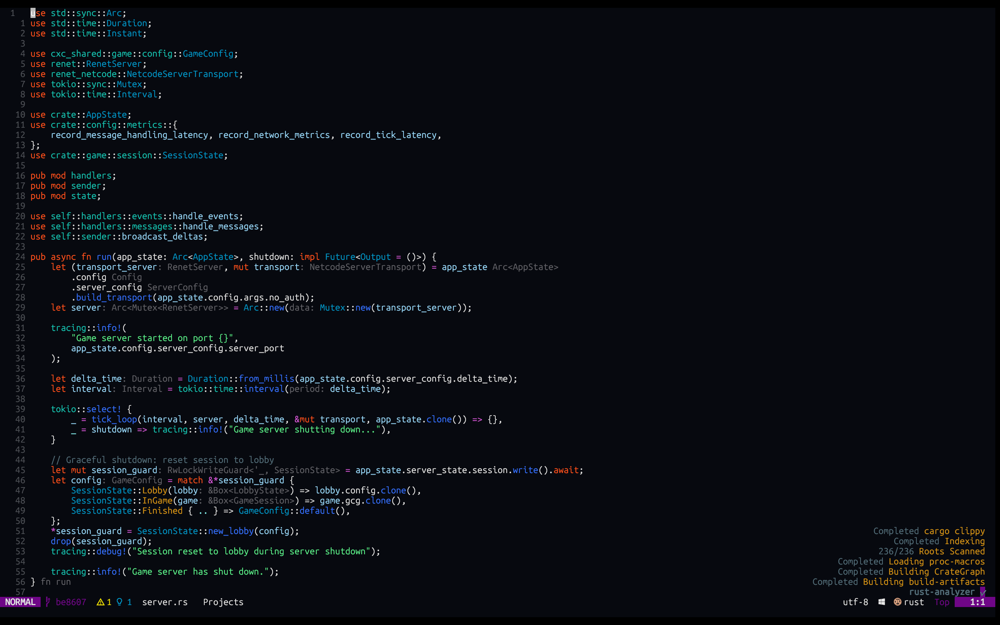

<div align="center">
  <h1>nagisa.nvim 🌠</h1>
   
</div>

A clean and minimalist Neovim colorscheme collection with dark backgrounds and vibrant highlights.

Ships with two themes:
- **Nagisa** (default) — warm orange dark theme with sunset vibes
- **EndOfTheWorld** — cold blue-black theme with vibrant red-orange highlights

### 🚧 Warning 🚧

Please note that the plugin is currently under lazy development. Any help is greatly appreciated as the author has limited time to dedicate to it.

### ⁉️ Why?

Author likes dark and red/orange mixed themes

## 📦 Installation

Download with your favorite package manager

### packer.nvim

```lua
use("sanzharkuandyk/nagisa.nvim")
```

### lazy.nvim

```lua
{
  "sanzharkuandyk/nagisa.nvim",
  lazy = false,
  priority = 1000,
  config = function()
      require("nagisa").setup({})
      vim.cmd.colorscheme("nagisa")
  end,
},
```

### Colorscheme

```vim
" Warm orange theme (default)
colorscheme nagisa

" Cold blue-black theme
colorscheme EndOfTheWorld
```

```lua
-- Warm orange theme (default)
vim.cmd.colorscheme("nagisa")

-- Cold blue-black theme
vim.cmd.colorscheme("EndOfTheWorld")
```

### Compile

```vim
" 1. Modify your config
" 2. Restart nvim
" 3. Run this command:
:NagisaCompile
```

## ⚙️ Configuration

```lua
require("nagisa").setup({
  theme = "Nagisa", -- or "EndOfTheWorld"
  transparent = false,
  italic_comments = true,
  underline_links = true,
  disable_nvimtree_bg = false,
  color_overrides = {
    blue = "#00A1D6",
    green = "#00FF88",
    back = "#121212",
  },
  group_overrides = {
    Comment = { fg = "#BBBBBB", style = "italic" },
    CursorLine = { bg = "#1A1A1A" },
    NvimTreeFolderIcon = { fg = "#F0E100" },
    DiagnosticError = { fg = "#FF5555", style = "bold" },
  },
})
```

## Acknowledgements

- [Kanagawa](https://github.com/rebelot/kanagawa.nvim) - The project structure was inspired by this theme. Since nagisa theme is under lazy development, it is suggested to try out.
- The theme name was inspired by a character from the anime [Clannad](https://myanimelist.net/anime/2167/Clannad).
